1538 年的春天，苏州文人黄省曾正收拾行装，准备进京参加科举考试。然而友人田汝成的一次拜访却彻底改变了黄省曾的计划。

田汝成从西子湖畔而来，兴致勃勃地向好友说起了西湖的种种自然人文美景，黄省曾越听越兴奋，做了一个大胆而浪漫的决定：放弃北上赶考，改道前往西湖旅游。

从黄省曾的例子中我们大抵可以窥见中国文人心中挥之不去的“西湖情结”。在明代文人袁宏道看来，西湖的美甚至具备健脾强身的药用价值，他曾在病后给友人寄去一封信。信的意思很简单：我生病了，要去西湖玩玩才能好起来。

原来不只在今天，几百年前的古人间就已经掀起了西湖旅游的热潮。 而这股热潮竟然得益于明代西湖游记的风靡 。明代出版商陈昌锡打造的《湖山胜概》就是其中的一件精品，得到了当时文人士大夫的追捧。

几百年后，这本图文并茂的明代旅行图书辗转流至法国国家图书馆。 南京大学的学者李晓愚寻访至此，被其美妙绝伦的刊刻和精美的六色套印插图所叹服，决定对其进行研究。此后，她一部部地寻访流落到海外的插图古籍，开启了一段跨越十几年的海外中华插图古籍寻绎之旅。

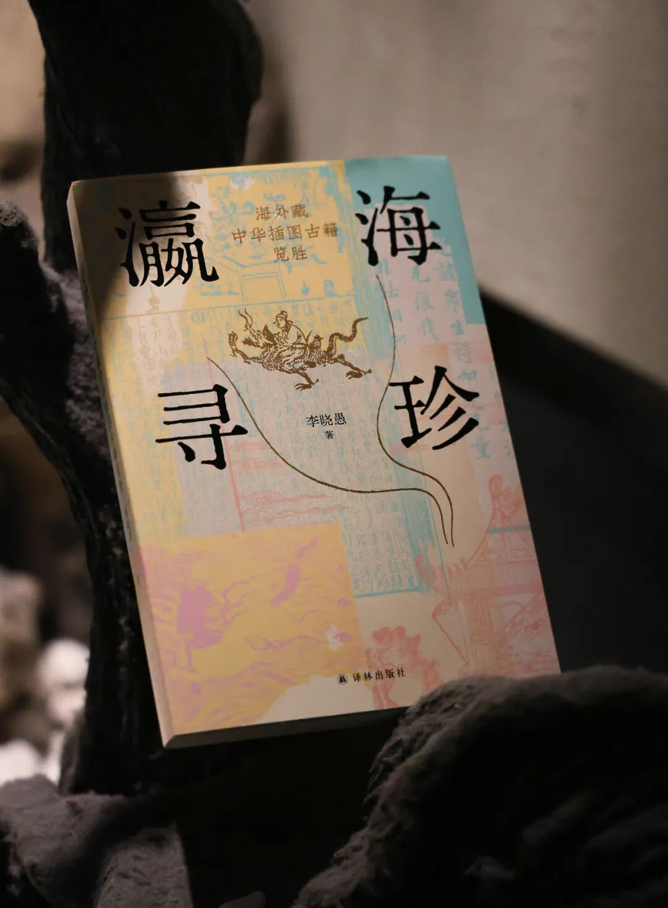

01

古人如何做书？

把书籍当作一件艺术品去打造

《湖山胜概》的出版人陈昌锡是一位颇具才干的文人，他不仅从权势显赫的司礼监太监那里借到了进献皇上的“吴山十景图”，邀请包括士大夫官员、艺术家、僧侣在内的社会名家为之题诗，还将之刊刻成一部精美绝伦的书。

在装帧设计上，陈昌锡采取了诗、书、画三者结合的设计形式。一般的书籍多采用统一规范化的字体，即“宋体字”，它是在明代为适应印刷术需要而产生的。不过在讲求精致品味的文人看来，这种拘紧刻板的字体显得有些庸俗。

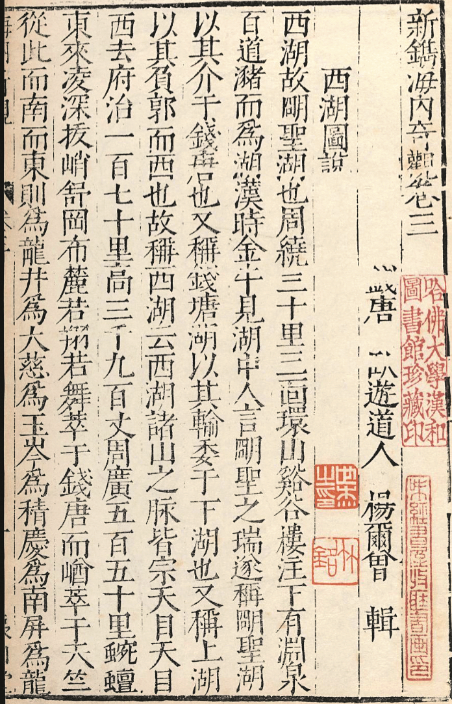

明刊本《新镌海内奇观》中使用的宋体字

为了提升书籍的艺术品位，陈昌锡在《湖山胜概》中以个性化的书法摹写替代了标准化的印刷字体，邀请当时颇有名气的书家来执笔。面对不同书风的作品，读者除了可以感受到书法艺术的审美趣味，还能体会到书家强烈的个性特征，这无疑提升了书籍的艺术品位。

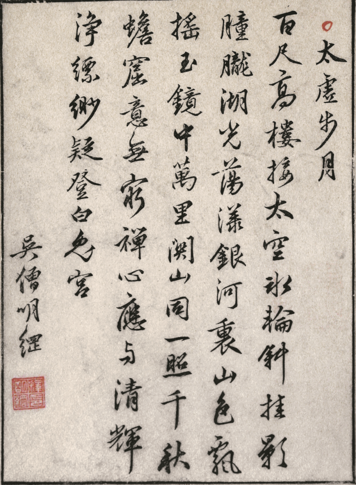

明代吴僧明纲为《湖山胜概》题写的诗词

而且，不同于一般印刷书籍翻刻的印信，《湖山胜概》中所有印信都是真印钤盖，或多或寡，或朱或白，似乎都是按照作者原来的手迹加以钤盖的。

除了书法，《湖山胜概》还特别注重图像的视觉感染力。其线条工整细致，画面极富雅丽生趣。书中的版画部分采用了六彩套印的技术，这是当时非常先进的一种印刷手段。

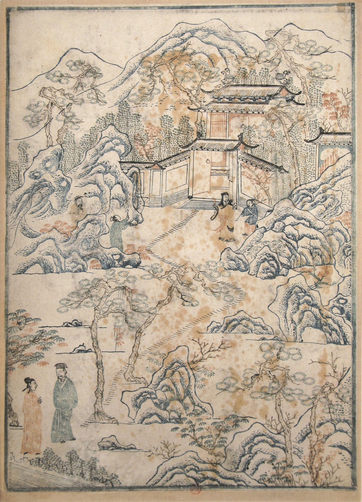

《湖山胜概》之“云居雪松”

陈昌锡之所以花费巨大成本，精心设计刊刻这部书，是因为他心中所设定的读者并非普通的市民，而是有教养的士大夫。对于他们来说，占有能够带来视觉愉悦感的书籍，与占有书画、古玩等“雅物”一样，是一种身份和品位的象征。

从装帧设计、书法风格、套色技法和印章钤盖等各方面看，巴黎本的《湖山胜概》都是一部充满文人情趣的读物。

02

明代文人的出行风尚

“时尚潮男”的OOTD？

以审美的眼光来看，《湖山胜概》当然是一件绝佳的艺术品。不过，我们也可以去关注书中插图的内容本身，会有不一样的发现。

明人撰写过许多旅行笔记，我们从文字内容中可以领略很多当时旅游风尚的点滴。但是《湖山胜概》中的图像却有一种神奇的力量，可以让人更加生动地“想象过去”：比如，他们旅行时选取何种交通方式，穿什么衣服，带何种装备，有哪些娱乐活动，等等。

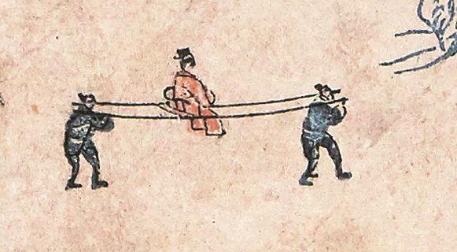

明人的出行工具“竹兜子”

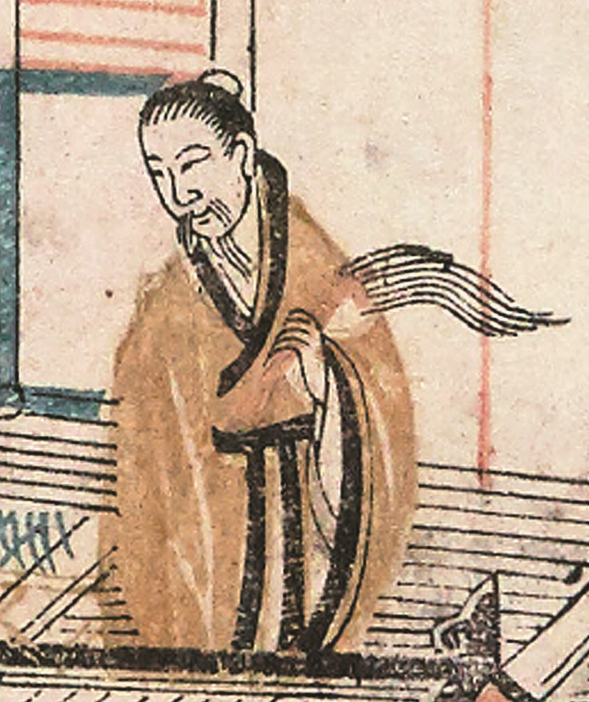

晚明士人出行常身着“道服”，塑造出一种超然散淡的隐逸形象

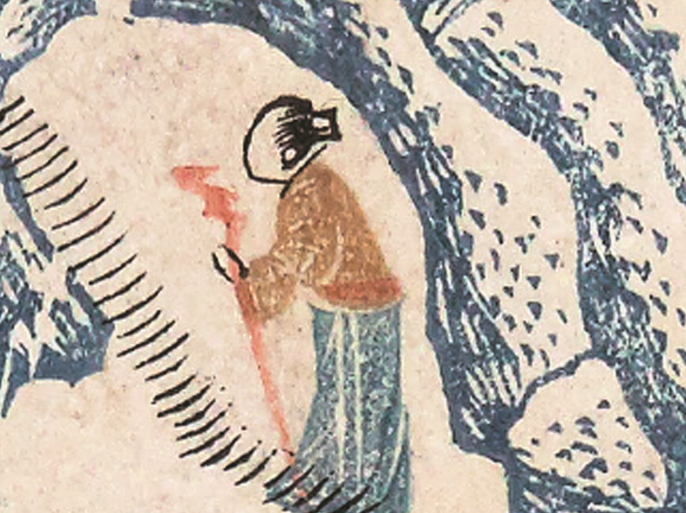

明人用的手杖，又称“扶老”，适用于辅助山间行走

我们来看看明人出行时戴的帽子。其中最流行的帽子可以说是“瓜皮帽”了。《湖山胜概》的插图中有位男士就戴着这款帽子。这款帽子据说是明朝开国皇帝朱元璋亲自设计的，由六块黑缎子或绒布连缀制成。它原本有个相当大气的名字——“六合一统帽”。因为它的形状像半个西瓜皮，民间俗称“瓜皮帽”。

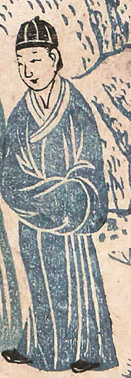

头戴“六合一统帽”的男子

除了“六合一统帽”之外，《湖山胜概》的插图中还出现了好几款其他样式的帽子。通过这些图画，我们可以把握明代男子的穿搭时尚。

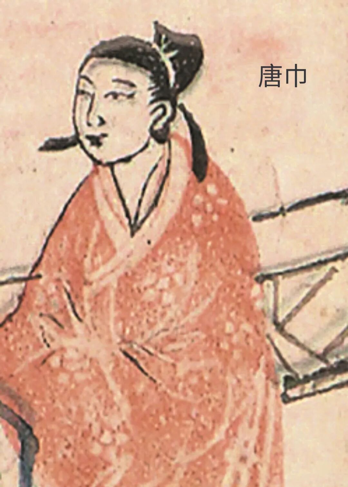

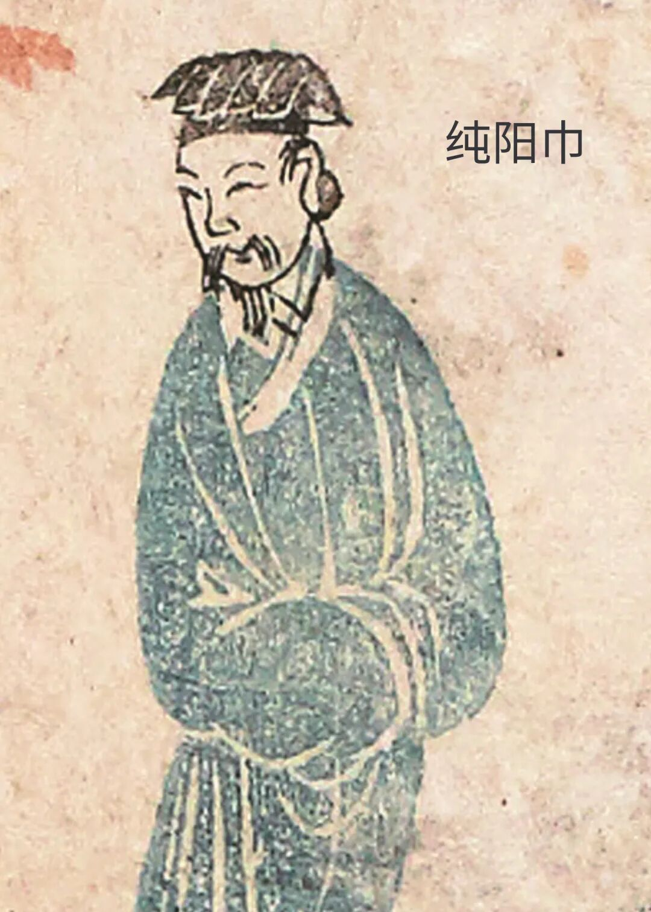

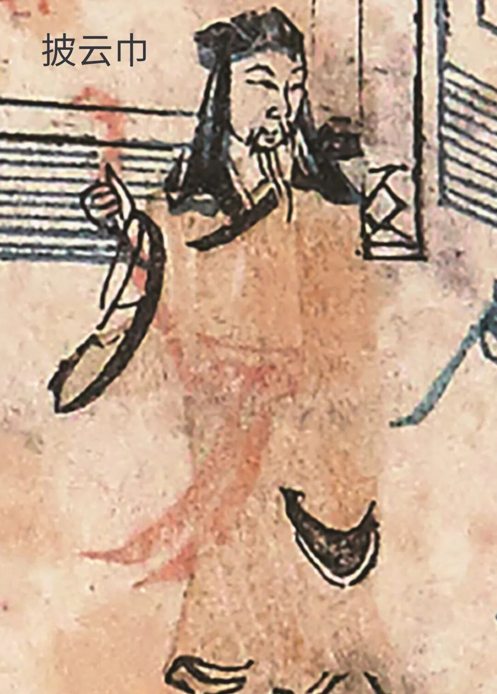

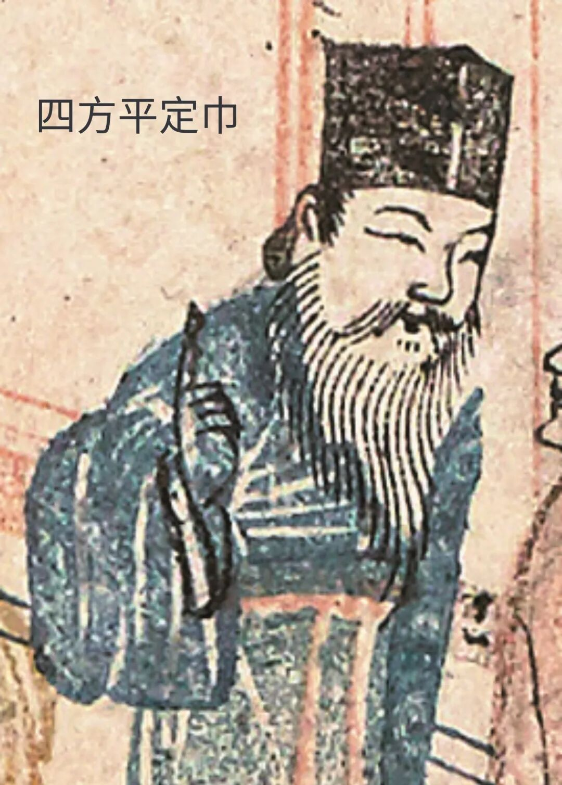

左右滑动查看图集

03

如何一边躺平一边旅行？

书斋旅行者的“精神胜利法”

无独有偶，明代的另一位叫杨尔曾的书商也镌刻了一部图文并茂的旅游指南：《新镌海内奇观》。全书共十卷，依次介绍了五岳、孔林、黄山、西湖、天台山、武夷山、潇湘、峨眉山等风景名胜。

这本书图画数量很大，全书共130余幅风景画，图画质量精美，全书绘制工整，镌刻精妙，笔笔传神，刀刀得法。

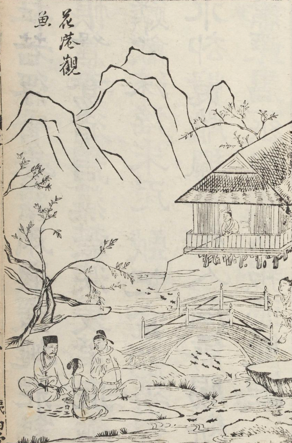

《新镌海内奇观》之“花港观鱼”

杨尔曾的好友陈邦瞻在书中的推荐序中指出，杨尔曾刊刻《新镌海内奇观》这部有图有文的旅行指南是对南朝画家宗炳卧游的一种模仿。 “卧游”最初的意思是以欣赏山水画替代游览，“卧”是身体的静止，“游”是精神的活跃。“卧游”之“游”并非身体之游，而是精神之游。

当老病来袭，宗炳借绘制于墙壁上的山水画实现了卧游之旅。他或许不曾想到此举既扩展了山水画的功能，也开启了一种全新的旅游方式。

晚明的旅游之风不只在士大夫圈子中盛行，也蔓延到了社会中下层。旅游活动也从官员的“宦游”、士大夫的“士游”，普及为大众旅游。这刺激了旅游相关书籍的出版，是出版行业对市场需求的积极回应。

以杨尔曾为代表的书商费尽心力地将旅游指南与“卧游”相联系，不过是想借宗炳的典故提升该书的文化档次，为商业化的行为披上一件高雅的外衣。而这一策略之所以获得成功，恰恰在于它迎合了普通消费者的心理：我们要追随并仿效精英阶层的生活方式。

结语

《瀛海寻珍：海外藏中华插图古籍览胜》所收古籍，除了以上提到的两本，还包括 世界上最古老的印本《金刚般若波罗蜜经》（英国国家图书馆藏）、五代十国的袖珍经卷《宝箧印经》（哈佛大学福格艺术博物馆藏）、明刊孤本《异域图志》（英国剑桥大学图书馆藏）等，都具有极高的文物价值、文献价值和美学价值，堪称“书籍之为艺术”的典范。

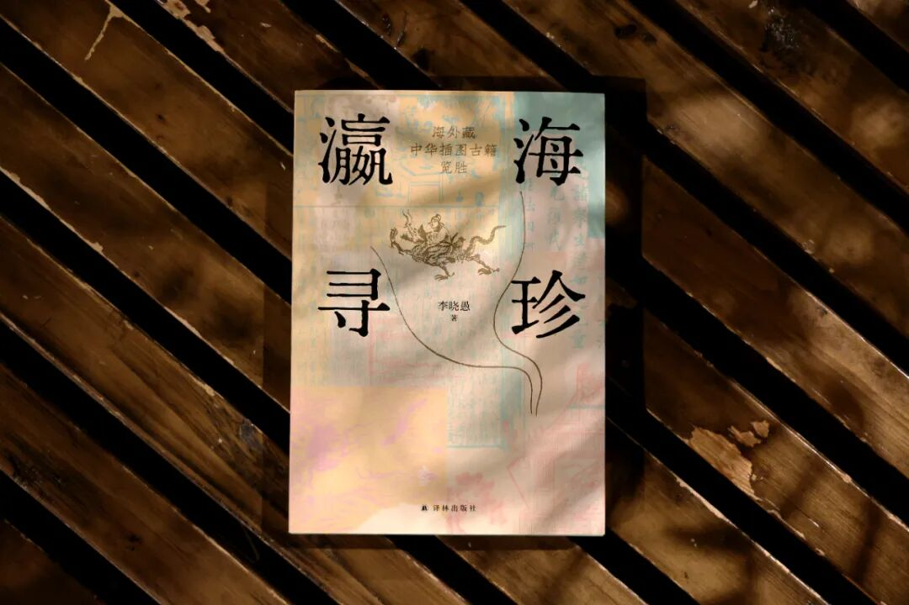

这些插图古籍此前几乎都未见影印，其中不少是世间罕见甚至独一无二的孤本。 它们因种种原因流落海外，深藏在博物馆、图书馆或私人藏书家手中，普通人难得一见。

而李晓愚教授在十几年间一部一部地寻访和研究，唤醒了这些沉睡百年乃至千年的古籍珍品，揭开了它们的神秘面纱，呈现了传统文化中精妙的视觉世界。 如中国美术学院教授范景中所言：“漂洋过海的珍本，经十余年寻绎梳理，终得以另一种方式‘回归故里’。从此，不必远涉巴黎、伦敦、东京，亦能与国宝欣然相晤。”

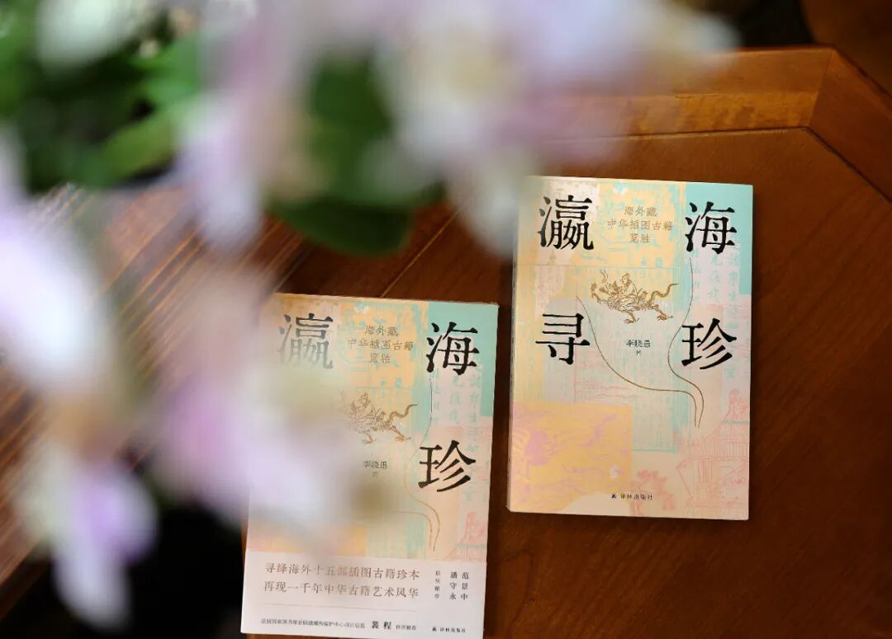

于是我们才知道：世界上最古老的印本《金刚般若波罗蜜经》，乃是一个普通书生为双亲祈福所刊印；杭州雷峰塔倒下后才被发现的袖珍经卷《宝箧印经》，竟是吴越国王钱俶为积累功德而供入塔中；《异域图志》里古人想象出来的“人 + 动物”的魔幻拼接，反映出“夷狄禽兽论”的古老观念。

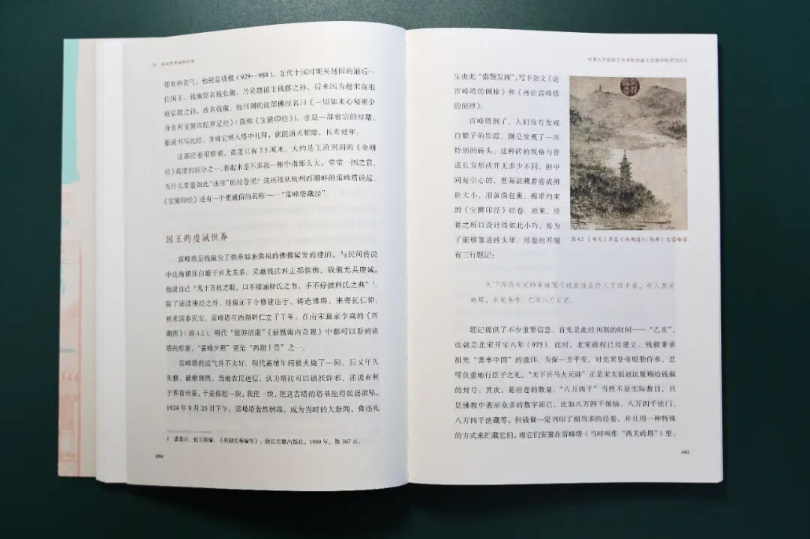

这本书论述的插图古籍涉及古人生活的方方面面： 从外交、科学，到居家、娱乐、旅游、育儿。一部一景，它展示的不只是书籍的胜景，更是古人生活世界的胜景。 李晓愚在书中说：“我希望这些插图古籍的研究，可以让今天的读者与我们的古人多一分亲近。”

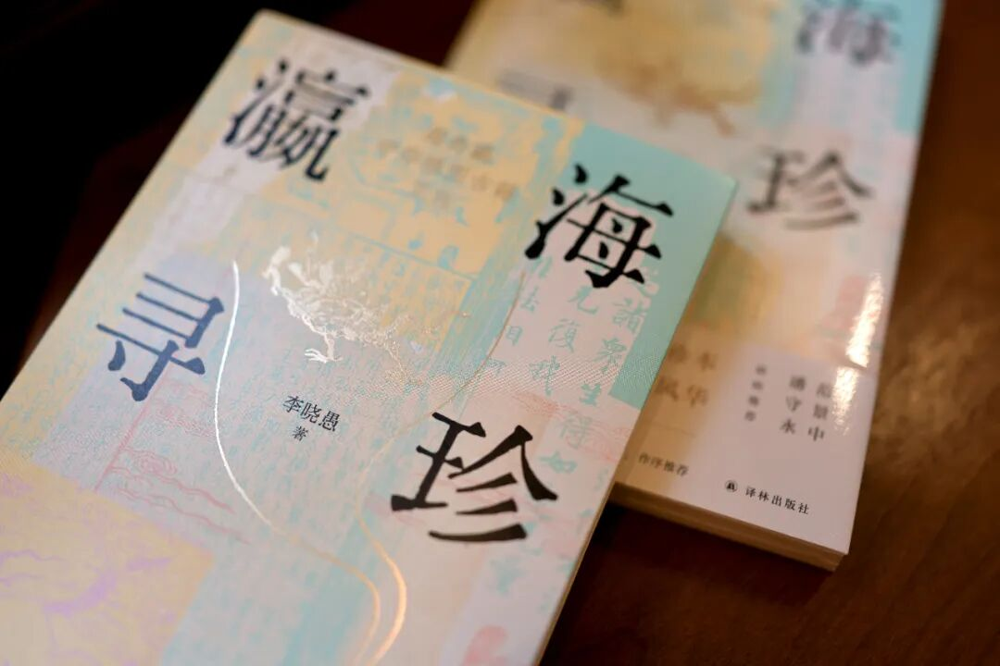

《瀛海寻珍：海外藏中华插图古籍览胜》中呈现的这些古老典籍是脆弱的，也是坚韧的。它们穿越了百年乃至千年的时光，历经重重艰险，来到我们这个时代。古籍记录了古人的生活，传递着他们的愿望、信仰、情感。有了它们，我们才能真真切切地触摸中华历史、感知古典文明。