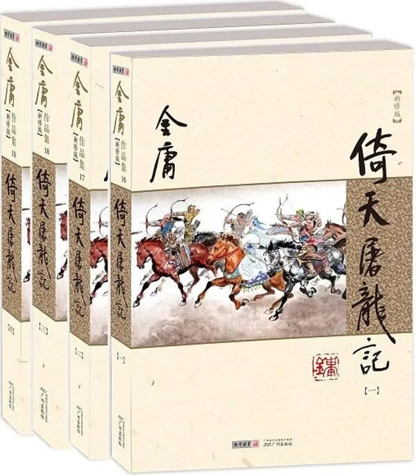
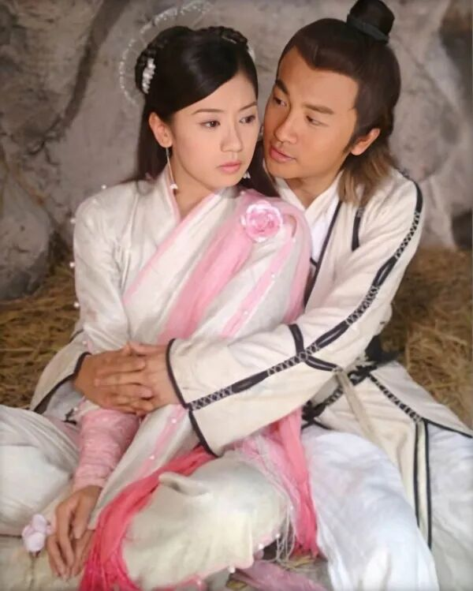
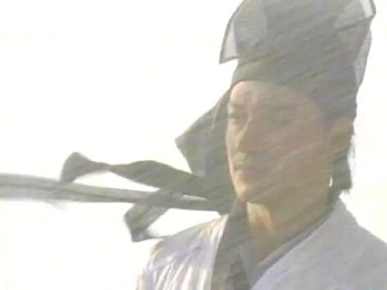

评点是中国古典小说独有的鉴赏传统，经金圣叹、脂砚斋而发扬光大，其将批者的妙语附在小说字里行间，兼具文化与美学意义。金庸小说的根脉深处，也流淌着中国古典小说的血液。本专栏便从中国传统评点学视角，对金庸小说逐一复盘，细读金庸江湖的叙事美学与技法得失。

《倚天屠龙记》（新修版），广州出版社， 2013年4月版

通俗武侠小说的主角要么奇遇连连、要么快意恩仇，像《倚天屠龙记》这样，主角张无忌从一登场就处处吃瘪、常常受骗的情况并不多见。尤其在第十六回张无忌学得九阳神功成年以前，更是饱经磨难。有网友总结：“受苦受难释小龙（2003版《倚天屠龙记》中少年张无忌的扮演者），左拥右抱苏有朋（2003版中成年张无忌扮演者）”，的确，成年前的张无忌几乎是一个坎接着一个坎，吃一堑再吃一堑，不是被骗就是在被骗的路上。

2003版电视剧《倚天屠龙记》中的张无忌与赵敏

金庸为何要给刚刚踏上江湖的主角安排如此密集的挫折？难道仅仅是为了写他天真仁厚、不谙世事吗？实际上，这连环的困局与骗局，不仅塑造了主角的个性，同时延续着全书的主题，将元末江湖中正邪之间、旧道德与真实善恶之间的种种错位一一呈现。

从情节结构上看，张无忌中毒求医到六派围攻光明顶，这十回中金庸精心设计了不同机制的江湖陷阱与道德欺瞒。这些困局与骗局看似是张无忌个人的际遇，实际上却是第十回武当寿宴张翠山惨死的回声，延续着借由屠龙刀这一线索展开的正邪之辨与义利矛盾。

张无忌带着杨不悔刚出蝴蝶谷，就在荒野中被“恩将仇报”。他曾在绝境中救下简捷、薛公远，然而这两个自称侠义道的人物，在饥饿面前毫不犹豫地撕下道德面具，企图将救命恩人熬成肉汤。这一次张无忌被骗，是因为世道险，人相食。

随后历经千难万险，张无忌将杨不悔带到昆仑山寻找她的生父，又再一次被“恩将仇报”。这次张无忌受托救治昆仑掌门何太冲的爱妾，却因为不了解大掌门复杂的家庭关系（妻管严）和过早暴露了自己的身份，以至于被何太冲、班淑娴夫妇混合双打，要不是杨逍及时赶来，多半难逃此劫。

到第十五回，金庸更是为张无忌安排了最炫目也最致命的“骗局”。朱长龄、朱九真、武青婴等人，头顶着一灯大师弟子、大理段氏渊源的名门后裔光环，用如花的容貌、无微不至的亲情关怀与慷慨豪迈的长者之风，装作要为张无忌父亲、他们的“恩公”复仇，骗取了全部的信任，实际上却同样只是为了骗他说出谢逊所在。口上谈着恩情，心里只是利益。最终张无忌无意得知真相后，被迫跳下了万丈悬崖。

及至学会九阳神功之后，张无忌武功固然高了，却依然在被骗，先是被殷离捉弄，最后在光明顶上和明教众人一起被成昆欺骗，差点困死在光明顶。

经历了这一连串的欺骗与逼迫，元末的江湖才显露出了它复杂的真容：表面上正气凛然之人，内心也许肮脏不堪；表面上邪魅诡怪之人，却可能有勇气、胆魄和大义。

1994版电视剧《倚天屠龙记》剧照

在塑造这一系列令人窒息的困局时，金庸技法依旧娴熟，其中最核心的便是“眼中叙”与“逼拶法”的结合。

所谓“眼中叙”，即叙事视角的选择。金庸没有采用全知全能的上帝视角去预先揭穿骗局，而是将读者的视线紧紧绑定在张无忌的所见所感上。当朱九真对张无忌假以辞色，当朱长龄为了逼真甚至烧毁自家庄园时，读者和张无忌一样，完全被表象所蒙蔽，并随后在血淋淋的真相面前感受到同等的震撼。

与“眼中叙”相辅相成的，是“逼拶法”。“逼拶”最早出自八股评点，后被用于小说评点，借指叙写过程中通过层层铺垫、步步紧逼，从而产生“惊奇”和“紧张”感。百岁寿宴上六大派的步步紧逼是逼拶，破庙中简捷薛公远的屠刀是逼拶，连环庄里朱长龄的不绝追击更是逼拶。在最初的报纸连载版中，张无忌曾在少林寺得传部分九阳神功；但在后来的三联版与新修版中，金庸删去了这些尚存“温情”的段落，而凸显元末江湖大门派的狭隘冷漠，更着力刻画寒毒发作、求医无果、连环受骗等种种挫折。这种改动，正是“逼拶法”的运用，使每一次的受骗与被逼显得更加紧迫、挫折更加逼真。

也正是通过设计张无忌不断被骗的情节，小说主角的塑造才能够同全书整体主题的显现浑然天成地融合在了一起。这些情节不仅在塑造张无忌赤子般宽厚、仁善的性格特征，同样也在借着张无忌的眼睛逐渐认识眼下这个正邪界限分明、善恶与正义却晦暗不彰的时代。这个时代的特征是，表面上统治江湖的依然是正邪对立的逻辑与规范，然而实际上潜藏的矛盾是私利（屠龙刀“武林至尊”的表层含义）与大义（屠龙刀保家卫国的真实含义）、伪与真的对立，旧的规则与旧的道德依旧很强势，正派与邪派仿佛天然对立，势同水火，但很多人只是借重着这个规则，满足自身的私欲或是摆摆掌门人的架子。正派的架子越来越大、规则越来越多，但基于本性的纯良与义气却越来越少，这是旧制度与旧规则绵延日久、尾大不掉的必然规律。

张无忌的特殊性在于，他生长于冰火岛，人生的前十年他从未亲身体会这些世俗世界的规则，所以他有着一颗赤子之心，所以他总是被骗。也就是在这一次次被骗的过程中，读者随着张无忌一起体会和感受着元末这个秩序崩塌、人心不古的江湖，而也只有怀揣着赤子之心的人们，才能改天换地，开辟一个新的秩序。

**微时代的首选书单**
**责任编辑：**
**顾明**

本文为澎湃新闻翻书党独家原创稿件，转载请留言申请，或发邮件至： ppfanshudang@163.com